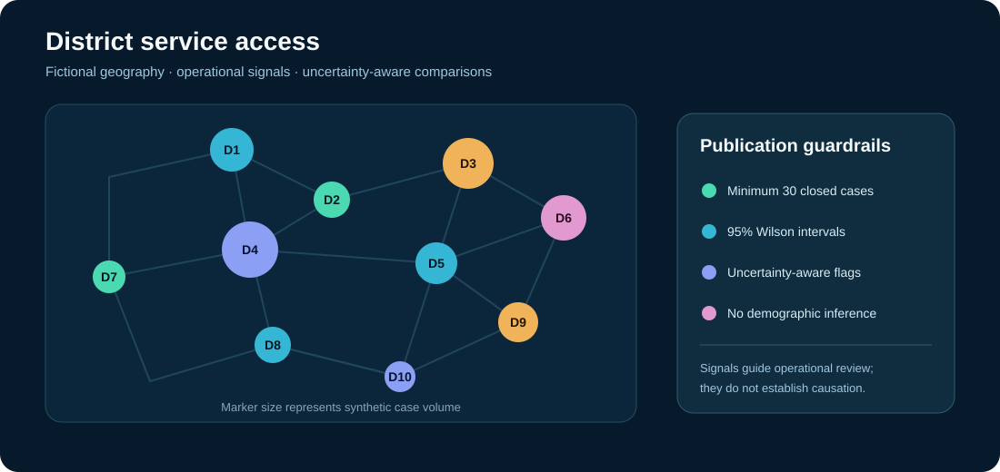
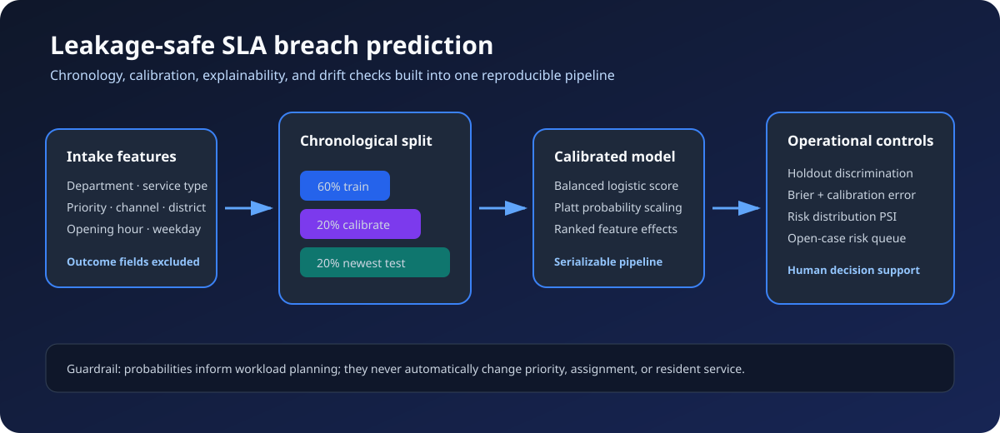
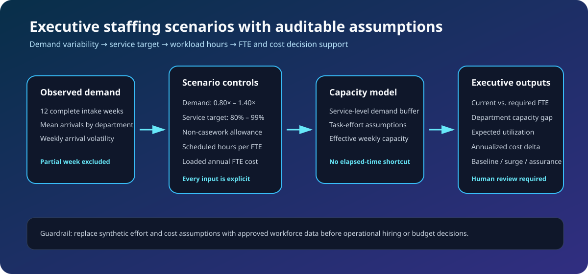

# CivicFlow Analytics


CivicFlow Analytics is an original, production-style portfolio project for measuring how municipal service teams manage resident requests. It combines realistic synthetic cases, explicit domain rules, immutable lifecycle history, a relational operations warehouse, calibrated SLA-risk prediction, transparent staffing scenarios, reproducible reporting, and an interactive operations console.








## Why this project exists

Public-service dashboards are only credible when their operational definitions are clear. CivicFlow treats each metric as the output of a validated case ledger instead of starting with visualizations. The generator preserves realistic relationships between priority, SLA target, department, team, closure state, and satisfaction.

No real resident information is used. All records are synthetic and generated locally.

## Current capabilities

- Deterministic generation with an explicit seed and UTC timestamps
- Five municipal departments, fifteen service types, four intake channels, and priority-based SLA targets
- Data-contract checks for unique IDs, valid lifecycles, districts, targets, and satisfaction values
- Department-level case volume, backlog, breach, compliance, and resolution-time metrics
- Active-backlog aging buckets, current breaches, and 24-hour SLA exposure
- Median and p90 first-action, active-work, and end-to-end resolution cycle times
- Monthly intake cohorts that preserve open-case counts while reporting closed-case outcomes
- District service-access metrics with fictional geospatial centroids and workload-normalized volume
- Small-cohort suppression, 95% Wilson intervals, and uncertainty-aware benchmark flags
- Leakage-safe SLA-breach prediction with chronological train, calibration, and test windows
- Calibrated probabilities, interpretable feature effects, top-decile recall, and drift monitoring
- Configurable staffing scenarios with demand, service-level, effort, shrinkage, and cost assumptions
- Department capacity gaps, expected utilization, and executive baseline/surge/assurance comparisons
- Transactional SQLite warehouse with case dimensions, status-event facts, indexes, and a current-state view
- Interactive dashboard with operational KPIs, cohort trends, and a filter-aware risk queue
- Stable CSV case output and JSON metric output
- Installable CLI, non-root Docker runtime, CI quality gates, and automated tests

## Quick start

```bash
python -m venv .venv
source .venv/bin/activate
python -m pip install -e ".[dev]"
ruff check .
ruff format --check .
pytest
civicflow --cases 5000 --seed 20260922 --output-dir data/generated
```

Generated artifacts:

- `data/generated/service_cases.csv`: row-level synthetic case ledger
- `data/generated/sla_report.json`: reconciled department metrics
- `data/generated/backlog_report.json`: active workload age and SLA exposure
- `data/generated/cycle_time_report.json`: median and p90 workflow stage durations
- `data/generated/cohort_report.json`: intake-month volume, outcomes, and compliance
- `data/generated/district_service_report.json`: safeguarded district access and SLA metrics
- `data/generated/sla_prediction_report.json`: holdout discrimination, calibration, drift, and driver metrics
- `data/generated/open_case_risk_scores.csv`: ranked, calibrated open-case risk queue
- `data/generated/sla_risk_model.joblib`: fitted preprocessing, classifier, and calibration pipeline
- `data/generated/staffing_scenario_report.json`: reconciled baseline, surge, and high-assurance staffing plans
- `data/generated/civicflow.db`: relational case and lifecycle-event warehouse

## Interactive dashboard

```bash
civicflow --cases 5000 --seed 20260923 --output-dir data/generated
streamlit run src/civicflow/dashboard.py
```

Open `http://localhost:8501`. If the warehouse does not exist, the dashboard creates a deterministic 5,000-case demonstration dataset. Set `CIVICFLOW_DB=/path/to/civicflow.db` to use a mounted warehouse.

The console supports multi-select department and district filters. Its KPI cards distinguish closed-case compliance from current open-case breaches; workflow charts show response and active-work time; monthly cohorts make trend changes visible without mixing intake periods. A synthetic district map sizes markers by case volume and pairs them with uncertainty-aware service comparisons. The risk view ranks matching open cases by calibrated breach probability and displays holdout quality, calibration error, distribution drift, and interpretable model drivers. Executive controls let leaders vary demand, service targets, and non-casework time, then compare current and required FTE by department.

## Docker

```bash
docker build -t civicflow-analytics .
docker run --rm -v "$PWD/data/generated:/home/civicflow/output" civicflow-analytics

docker build -f Dockerfile.dashboard -t civicflow-dashboard .
docker run --rm -p 8501:8501 civicflow-dashboard
```

The container runs as an unprivileged user and writes only to the mounted output directory.

## Metric definitions

| Metric | Definition |
|---|---|
| Closed cases | Cases containing a closure timestamp |
| Open cases | Cases without a closure timestamp |
| SLA breach | Closed case where elapsed hours exceed its priority target |
| Compliance rate | Closed cases meeting SLA divided by all closed cases |
| Average resolution | Mean elapsed hours across closed cases |

Open cases are intentionally excluded from final SLA compliance because their outcome is not yet known. The separate backlog report compares each active case's age with its SLA target, exposing current breaches and cases due within 24 hours without corrupting outcome metrics.

## Warehouse model

`dim_case` holds the stable service-request grain. `fact_case_status_event` holds one immutable row per status transition and uses a foreign key back to the case. The `current_case_state` view resolves the latest event for operational queries while retaining the complete history for cycle-time and workflow analysis. Every refresh is validated first and replaced inside one database transaction.

Cycle time is split into `open → in_progress` first action and `in_progress → resolved` active work. The p90 uses the auditable nearest-rank definition. Intake cohorts are keyed by the month opened; open cases remain in cohort volume but are excluded from final compliance until an outcome exists.

## District-analysis safeguards

Districts are fictional operational areas with synthetic centroids and populations. They are not demographic groups or real municipal boundaries. CivicFlow reports case volume per 1,000 synthetic residents, but suppresses SLA outcome rates until a district has at least 30 closed cases. Published rates include 95% Wilson confidence intervals; a district is marked higher or lower than the citywide benchmark only when its full interval falls on one side of that benchmark.

These controls reduce unstable rankings and discourage demographic conclusions that the dataset cannot support. A difference in service performance is a signal for operational investigation, not proof of inequity or causation.

## SLA-risk model governance

The model predicts whether a closed case will exceed its SLA target, using only fields available at intake: department, service type, priority, channel, district, opening hour, and opening weekday. Closure time, current status, satisfaction, target duration, elapsed time, and lifecycle events are excluded from features to prevent outcome leakage.

Closed cases are ordered by intake time, then divided into 60% training, 20% probability calibration, and 20% final test windows. A class-balanced logistic regression supplies explainable base scores; a separate Platt-scaling model calibrates those scores. The untouched newest window reports ROC AUC, average precision, Brier score, log loss, expected calibration error, and top-decile recall. Population stability index compares train and test risk distributions, with `stable` below 0.10, `watch` from 0.10 to 0.25, and `action_required` above 0.25.

Predictions are decision support for workload planning, not automatic case priority or assignment. Feature coefficients describe modeled associations in synthetic data and do not establish causation. A production deployment should retrain on approved historical data, review calibration by service segment, monitor drift on every scoring period, and require human review of operational policy changes.

## Staffing scenario methodology

Staffing forecasts use the latest 12 complete weeks of intake volume. For each department, the planner calculates mean weekly arrivals and arrival volatility, then applies the selected demand multiplier. The service-level target is converted to a normal-distribution quantile that adds a transparent workload buffer: a higher target can only maintain or increase planned demand.

Direct-work hours come from documented synthetic service-type assumptions, not elapsed case-resolution time. Elapsed time includes queues, routing, travel, and resident-response delays and would overstate labor demand. Required FTE equals buffered weekly work divided by scheduled weekly hours after the selected non-casework allowance. Annual cost deltas use a configurable loaded-cost assumption.

This is a planning model, not an automated hiring recommendation. Before real use, an agency should replace every effort, staffing, shrinkage, and cost assumption with approved workforce data; compare forecasts with schedule coverage and skill constraints; and require finance, labor, and service leadership review.

## Roadmap

- Add API ingestion, observability, load tests, and deployment guidance
- Add downloadable filtered extracts and a polished executive briefing image
- Add forecast backtesting and department-specific staffing assumption files

## Responsible use

Synthetic results are demonstrations, not claims about a real city or agency. The generator intentionally avoids names, addresses, real boundaries, and demographic attributes. District-level comparisons measure operational access only and must not be interpreted as demographic fairness findings.

## License

MIT
