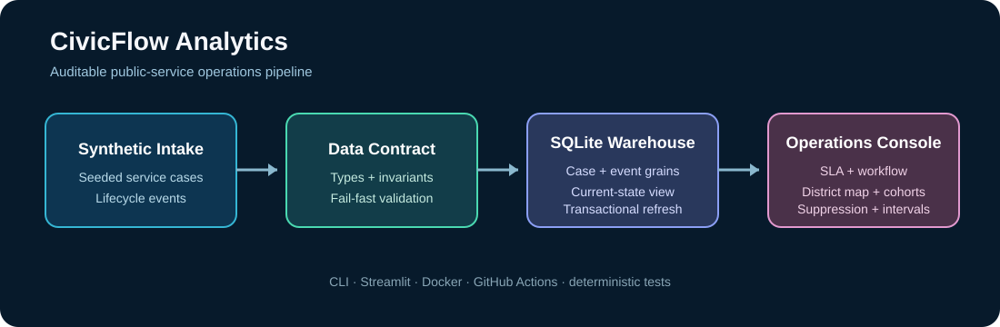

# CivicFlow Analytics


CivicFlow Analytics is an original, production-style portfolio project for measuring how municipal service teams manage resident requests. It combines realistic synthetic cases, explicit domain rules, immutable lifecycle history, a relational operations warehouse, reproducible SLA reporting, and an interactive operations console.



## Why this project exists

Public-service dashboards are only credible when their operational definitions are clear. CivicFlow treats each metric as the output of a validated case ledger instead of starting with visualizations. The generator preserves realistic relationships between priority, SLA target, department, team, closure state, and satisfaction.

No real resident information is used. All records are synthetic and generated locally.

## Current capabilities

- Deterministic generation with an explicit seed and UTC timestamps
- Five municipal departments, fifteen service types, four intake channels, and priority-based SLA targets
- Data-contract checks for unique IDs, valid lifecycles, districts, targets, and satisfaction values
- Department-level case volume, backlog, breach, compliance, and resolution-time metrics
- Active-backlog aging buckets, current breaches, and 24-hour SLA exposure
- Median and p90 first-action, active-work, and end-to-end resolution cycle times
- Monthly intake cohorts that preserve open-case counts while reporting closed-case outcomes
- Transactional SQLite warehouse with case dimensions, status-event facts, indexes, and a current-state view
- Interactive dashboard with department and district filters, operational KPIs, and cohort trends
- Stable CSV case output and JSON metric output
- Installable CLI, non-root Docker runtime, CI quality gates, and automated tests

## Quick start

```bash
python -m venv .venv
source .venv/bin/activate
python -m pip install -e ".[dev]"
ruff check .
ruff format --check .
pytest
civicflow --cases 5000 --seed 20260922 --output-dir data/generated
```

Generated artifacts:

- `data/generated/service_cases.csv`: row-level synthetic case ledger
- `data/generated/sla_report.json`: reconciled department metrics
- `data/generated/backlog_report.json`: active workload age and SLA exposure
- `data/generated/cycle_time_report.json`: median and p90 workflow stage durations
- `data/generated/cohort_report.json`: intake-month volume, outcomes, and compliance
- `data/generated/civicflow.db`: relational case and lifecycle-event warehouse

## Interactive dashboard

```bash
civicflow --cases 5000 --seed 20260923 --output-dir data/generated
streamlit run src/civicflow/dashboard.py
```

Open `http://localhost:8501`. If the warehouse does not exist, the dashboard creates a deterministic 5,000-case demonstration dataset. Set `CIVICFLOW_DB=/path/to/civicflow.db` to use a mounted warehouse.

The console supports multi-select department and district filters. Its KPI cards distinguish closed-case compliance from current open-case breaches; workflow charts show response and active-work time; monthly cohorts make trend changes visible without mixing intake periods.

## Docker

```bash
docker build -t civicflow-analytics .
docker run --rm -v "$PWD/data/generated:/home/civicflow/output" civicflow-analytics

docker build -f Dockerfile.dashboard -t civicflow-dashboard .
docker run --rm -p 8501:8501 civicflow-dashboard
```

The container runs as an unprivileged user and writes only to the mounted output directory.

## Metric definitions

| Metric | Definition |
|---|---|
| Closed cases | Cases containing a closure timestamp |
| Open cases | Cases without a closure timestamp |
| SLA breach | Closed case where elapsed hours exceed its priority target |
| Compliance rate | Closed cases meeting SLA divided by all closed cases |
| Average resolution | Mean elapsed hours across closed cases |

Open cases are intentionally excluded from final SLA compliance because their outcome is not yet known. The separate backlog report compares each active case's age with its SLA target, exposing current breaches and cases due within 24 hours without corrupting outcome metrics.

## Warehouse model

`dim_case` holds the stable service-request grain. `fact_case_status_event` holds one immutable row per status transition and uses a foreign key back to the case. The `current_case_state` view resolves the latest event for operational queries while retaining the complete history for cycle-time and workflow analysis. Every refresh is validated first and replaced inside one database transaction.

Cycle time is split into `open → in_progress` first action and `in_progress → resolved` active work. The p90 uses the auditable nearest-rank definition. Intake cohorts are keyed by the month opened; open cases remain in cohort volume but are excluded from final compliance until an outcome exists.

## Roadmap

- Add equity-safe and geospatial service-level analysis
- Add downloadable filtered extracts and saved dashboard views
- Add API ingestion, observability, load tests, and portfolio screenshots

## Responsible use

Synthetic results are demonstrations, not claims about a real city or agency. The generator intentionally avoids names, addresses, coordinates, and demographic attributes. Any future equity analysis will document safeguards against misleading small-group comparisons.

## License

MIT
